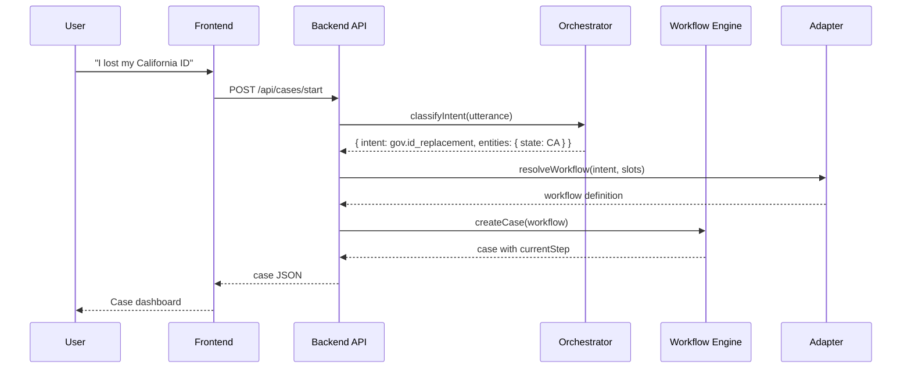

# Architecture

## Overview

```
User
  ↓
Frontend (Next.js) — case-centric UI + voice
  ↓
Backend API (Express on Render)
  ↓
AI Orchestrator — intent, slots, explanations (proposes only)
  ↓
Workflow Engine — owns state, transitions, validation
  ↓
Adapter Registry
  ↓
Domain Adapters (Government, Healthcare)
  ↓
Institution Connectors (dmv-ca, health-mock)
  ↓
Guide / Assist / Execute / Escalate
  ↓
Case Resolution
```

## Core principle

**The LLM interprets language. The workflow engine commits state.**

```
User message → AI extracts intent/entities → Engine validates → Adapter handlers → State update → UI refresh
```

The AI never directly mutates workflow state. It returns structured proposals; the engine accepts or rejects them.

## Folder layout

### `packages/shared/`

Shared TypeScript types used by backend and frontend:
- `Case`, `Requirement`, `WorkflowDefinition`, `IntentResult`, etc.

### `backend/src/services/`

| Service | Responsibility |
|---------|----------------|
| `workflow/engine.ts` | Load YAML, evaluate transitions, advance steps |
| `workflow/conditions.ts` | Evaluate `when` clauses (slots_filled, readiness, etc.) |
| `orchestrator/index.ts` | OpenAI integration, structured outputs |
| `voice/elevenlabs.ts` | TTS for next-action readout |
| `audit/index.ts` | Append-only audit events |
| `execution/index.ts` | Guide/Assist/Execute/Escalate mode enforcement |

### `backend/src/adapters/`

Each adapter implements `ServiceAdapter`:
- `classifyIntent()` — map utterance to intent ID
- `resolveWorkflow()` — pick workflow from intent + slots
- `handlers` — step handler functions (lookup, validate, execute)
- `calculateReadiness()` — 0–100 readiness score

### `backend/src/connectors/`

Institution-specific static/mock data:
- `dmv-ca/` — California DMV requirements, offices, fees
- `health-mock/` — mock providers, triage rules

### `backend/src/workflows/`

YAML workflow definitions versioned in git:
- `gov.ca_id_replacement.yaml`
- `health.musculoskeletal_nav.yaml`

### `frontend/src/`

Case-centric UI (not chat-first):
- `app/page.tsx` — Home with intent input
- `app/cases/[id]/page.tsx` — Case detail dashboard
- `components/case/` — Readiness bar, requirements, next action, timeline

## Data flow: starting a case



## Performance design

| Technique | Where |
|-----------|-------|
| Workflow YAML cached at startup | `workflow/loader.ts` |
| Adapter registry singleton | `adapters/registry.ts` |
| DB connection pooling | Prisma |
| React Query caching | Frontend |
| Streaming AI responses | `/api/cases/:id/chat` SSE |
| ElevenLabs audio cached by text hash | `voice/elevenlabs.ts` |
| Optimistic UI updates | Frontend mutations |

## Security (MVP)

- Mock single user for hackathon
- PII/PHI disclaimers in healthcare UI
- Emergency triage hard-coded (not LLM)
- Audit log on every state change
- CORS restricted to frontend origin

See [DEPLOYMENT.md](./DEPLOYMENT.md) for production considerations.
